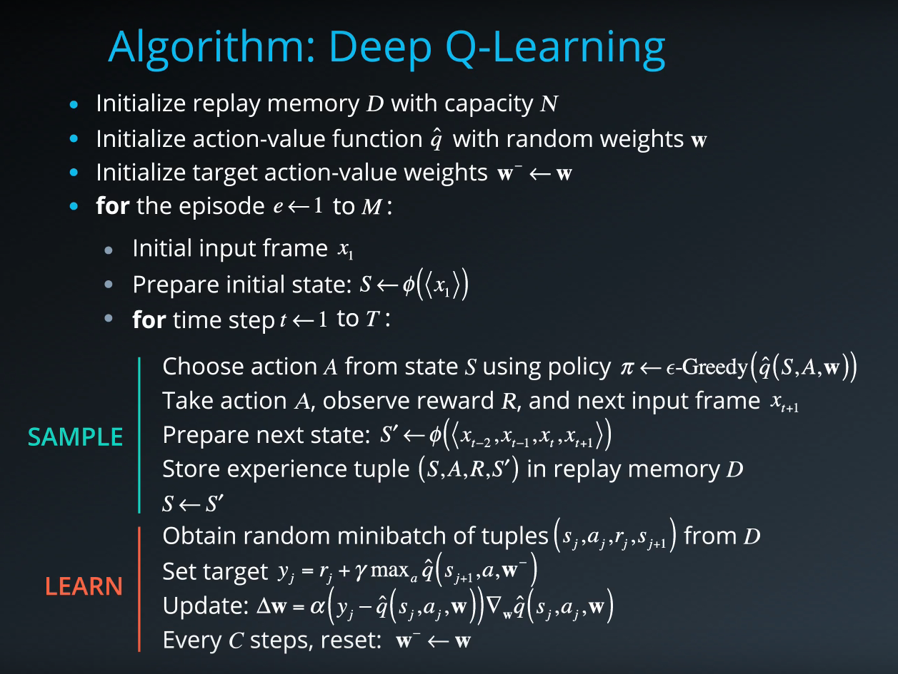
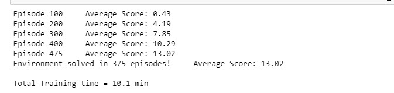
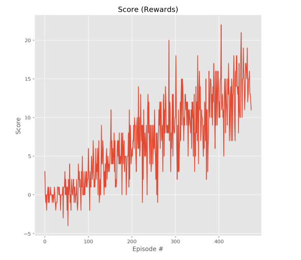

# Udacity Deep Reinforcement Learning 
# Navigation Project report

Dipali Gandhi dja24030@gmail.com

## Problem Statement

The goal of this project was to train an agent to navigate a simple world environment, collecting yellow bananas while avoiding blue bananas. 

In this project, I build a reinforcement learning (RL) agent that navigates an environment that is similar to [Unity's Banana Collector environment](https://github.com/Unity-Technologies/ml-agents/blob/master/docs/Learning-Environment-Examples.md#banana-collector).

The project environment is built in Unity that is similar to [Unity's Banana Collector environment](https://github.com/Unity-Technologies/ml-agents/blob/master/docs/Learning-Environment-Examples.md#banana-collector), customised for the Udactity Deep Reinforcement Learning nanodegree. The task is episodic and there are 37 different state space dimensions with 4 different possible actions. 

Rewards of +1 are accumulated when a yellow banana is collected and -1 when a blue banana is picked up. There are no rewards or penalties for moving. The task is considered solved when a score of 13 or more is achieved over 100 consecutive episodes. 

The state space has 37 dimensions and contains the agent's velocity, along with ray-based perception of objects around the agent's forward direction. 

Given this information, the agent has to learn how to best select actions. Four discrete actions are available, corresponding to:

- 0 - move forward.
- 1 - move backward.
- 2 - turn left.
- 3 - turn right.

The task is episodic, and **in order to solve the environment, the agent must get an average score of +13 over 100 consecutive episodes.**    


## Implementation

1. Evaluate the state and action space.
2. Establish baseline using a random action policy.
3. Implement learning algorithm.
4. Run experiments to measure agent performance.
5. Select best performing agent and capture video of it navigating the environment.

The model used successfully solved the problem after 422 episodes, which was exceptionally surprising given the extended target in the project was to have it acheive this with 1300 episodes. 

## Learning algorithm

This project implements a *Value Based* method called simple [Deep Q-Networks](https://deepmind.com/research/dqn/). 

### Deep Q-Networks

Deep Q Learning combines 2 approaches :
- A Reinforcement Learning method called [Q Learning](https://en.wikipedia.org/wiki/Q-learning) (aka SARSA max)
- A Deep Neural Network to learn a Q-table approximation (action-values)

Especially, this implementation includes the 2 major training improvements by [Deepmind](https://deepmind.com) and described in their [Nature publication : "Human-level control through deep reinforcement learning (2015)"](https://storage.googleapis.com/deepmind-media/dqn/DQNNaturePaper.pdf)
- Experience Replay 
- Fixed Q Targets

> Reinforcement learning is known to be unstable or even to diverge when a nonlinear function approximator such as a neural network is used to represent the action-value (also known as Q) function20. This instability has several causes: the correlations present in the sequence of observations, the fact that small updates to Q may significantly change the policy and therefore change the data distribution, and the correlations
between the action-values and the target values .
We address these instabilities with a novel variant of Q-learning, which uses two key ideas. First, we used a biologically inspired mechanism termed experience replay that randomizes over the data, thereby removing correlations in the observation sequence and smoothing over changes in the data distribution. Second, we used an iterative update that adjusts the action-values towards target values that are only periodically updated, thereby reducing correlations with the target.

### Algorithm



This algorithm screenshot is taken from the [Deep Reinforcement Learning Nanodegree course](https://www.udacity.com/course/deep-reinforcement-learning-nanodegree--nd893)


### Code implementation

The code used here is derived from the "Lunar Lander" tutorial from the [Deep Reinforcement Learning Nanodegree](https://www.udacity.com/course/deep-reinforcement-learning-nanodegree--nd893), and has been slightly adjusted for being used with the banana environment.

The code consist of :

- model.py : In this python file, a PyTorch QNetwork class is implemented. This is a regular fully connected Deep Neural Network using the [PyTorch Framework](https://pytorch.org/docs/0.4.0/). This network will be trained to predict the action to perform depending on the environment observed states. This Neural Network is used by the DQN agent and is composed of :
  - the input layer which size depends of the state_size parameter passed in the constructor
  - 2 hidden fully connected layers of 1024 cells each
  - the output layer which size depends of the action_size parameter passed in the constructor
- dqn_agent.py : In this python file, a DQN agent and a Replay Buffer memory used by the DQN agent) are defined.
  - The DQN agent class is implemented, as described in the Deep Q-Learning algorithm. It provides several methods :
    - constructor : 
      - Initialize the memory buffer (*Replay Buffer*)
      - Initialize 2 instance of the Neural Network : the *target* network and the *local* network
    - step() : 
      - Allows to store a step taken by the agent (state, action, reward, next_state, done) in the Replay Buffer/Memory
      - Every 4 steps (and if their are enough samples available in the Replay Buffer), update the *target* network weights with the current weight values from the *local* network (That's part of the Fixed Q Targets technique)
    - act() which returns actions for the given state as per current policy (Note : The action selection use an Epsilon-greedy selection so that to balance between *exploration* and *exploitation* for the Q Learning)
    - learn() which update the Neural Network value parameters using given batch of experiences from the Replay Buffer. 
    - soft_update() is called by learn() to softly updates the value from the *target* Neural Network from the *local* network weights (That's part of the Fixed Q Targets technique)
  - The ReplayBuffer class implements a fixed-size buffer to store experience tuples  (state, action, reward, next_state, done) 
    - add() allows to add an experience step to the memory
    - sample() allows to randomly sample a batch of experience steps for the learning       
- DQN_Banana_Navigation.ipynb : This Jupyter notebooks allows to train the agent. More in details it allows to :
  - Import the Necessary Packages 
  - Examine the State and Action Spaces
  - Take Random Actions in the Environment (No display)
  - Train an agent using DQN
  - Plot the scores

### DQN parameters and results

The DQN agent uses the following parameters values (defined in dqn_agent.py)

```
BUFFER_SIZE = int(1e5)  # replay buffer size
BATCH_SIZE = 64         # minibatch size
GAMMA = 0.99            # discount factor
TAU = 1e-3              # for soft update of target parameters
LR = 5e-4               # learning rate 
UPDATE_EVERY = 4        # how often to update the network
```

The Neural Networks use the following architecture :

```
Input nodes (37) -> Fully Connected Layer (1024 nodes, Relu activation) -> Fully Connected Layer (1024 nodes, Relu activation) -> Ouput nodes (4)
```

The Neural Networks use the Adam optimizer with a learning rate LR=5e-4 and are trained using a BATCH_SIZE=64

Given the chosen architecture and parameters, our results are :






**These results meets the project's expectation as the agent is able to receive an average reward (over 100 episodes) of at least +13, and in 1023 episodes only** (In comparison, according to Udacity's solution code for the project, their agent was benchmarked to be able to solve the project in fewer than 1800 episodes)


## Ideas for Future Work
- **Test the replay buffer** &mdash; Implement a way to enable/disable the replay buffer. As mentioned before, all agents utilized the replay buffer. Therefore, the test results don't measure the impact the replay buffer has on performance.
- **Add *prioritized* experience replay** &mdash; Rather than selecting experience tuples randomly, prioritized replay selects experiences based on a priority value that is correlated with the magnitude of error. This can improve learning by increasing the probability that rare and important experience vectors are sampled.
- **Replace conventional exploration heuristics with Noisy DQN** &mdash; This approach is explained [here](https://arxiv.org/abs/1706.10295) in this research paper. The key takeaway is that parametric noise is added to the weights to induce stochasticity to the agent's policy, yielding more efficient exploration.
